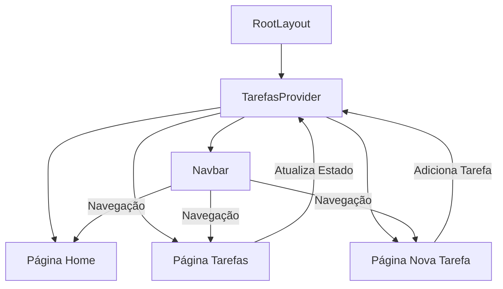

# Tutorial Atualizado para Next.js 14 (App Router)


## Sumário

1. Criando um projeto novo, adicionando libs e executando o projeto
2. Explicando a estrutura do projeto
3. Codificando o app
4. Possíveis extesões deste projeto

---

## Parte 1. Criando um projeto novo, adicionando libs e executando o projeto

**Para criar um projeto novo**, abrir o terminal e executar o comando abaixo
```bash
npx create-next-app@latest                                                                               qua 28 mai 2025 23:26:47
```

responder as perguntas
```bash
npm warn Unknown user config "auto-install-peers". This will stop working in the next major version of npm.
✔ What is your project named? … tarefas-context-e-route
✔ Would you like to use TypeScript? … No / Yes
✔ Would you like to use ESLint? … No / Yes
✔ Would you like to use Tailwind CSS? … No / Yes
✔ Would you like your code inside a `src/` directory? … No / Yes
✔ Would you like to use App Router? (recommended) … No / Yes
✔ Would you like to use Turbopack for `next dev`? … No / Yes
✔ Would you like to customize the import alias (`@/*` by default)? … No / Yes
✔ What import alias would you like configured? … @/*

```

uma saída possível
```bash
$ npx create-next-app@latest                                                                               qua 28 mai 2025 23:26:47
npm warn Unknown user config "auto-install-peers". This will stop working in the next major version of npm.
✔ What is your project named? … tarefas-context-e-route
✔ Would you like to use TypeScript? … No / Yes
✔ Would you like to use ESLint? … No / Yes
✔ Would you like to use Tailwind CSS? … No / Yes
✔ Would you like your code inside a `src/` directory? … No / Yes
✔ Would you like to use App Router? (recommended) … No / Yes
✔ Would you like to use Turbopack for `next dev`? … No / Yes
✔ Would you like to customize the import alias (`@/*` by default)? … No / Yes
✔ What import alias would you like configured? … @/*
Creating a new Next.js app in /home/minora/minora/2025/infoweb-pos/tarefas-context-e-route.

Using npm.

Initializing project with template: app-tw 


Installing dependencies:
- react
- react-dom
- next

Installing devDependencies:
- typescript
- @types/node
- @types/react
- @types/react-dom
- @tailwindcss/postcss
- tailwindcss
- eslint
- eslint-config-next
- @eslint/eslintrc

npm warn Unknown env config "auto-install-peers". This will stop working in the next major version of npm.
npm warn Unknown user config "auto-install-peers". This will stop working in the next major version of npm.

added 402 packages, and audited 403 packages in 43s

165 packages are looking for funding
  run `npm fund` for details

found 0 vulnerabilities
Initialized a git repository.

Success! Created tarefas-context-e-route at /home/minora/minora/2025/infoweb-pos/tarefas-context-e-route

```

lembrar de acessar a pasta do projeto
```bash
cd tarefas-context-e-route

```

**para adicionar a _lib_**
```bash
npm install @heroicons/react
```

uma possível saída para execução
```bash
[tarefas-context-e-route] $ npm install @heroicons/react

npm warn Unknown user config "auto-install-peers". This will stop working in the next major version of npm.

added 1 package, and audited 404 packages in 3s

165 packages are looking for funding
  run `npm fund` for details

found 0 vulnerabilities

```

**para executar o aplicativo web**

```bash
npm run dev
```

uma saída possível
```bash
[tarefas-context-e-route] $ npm run dev

npm warn Unknown user config "auto-install-peers". This will stop working in the next major version of npm.

> tarefas-context-e-route@0.1.0 dev
> next dev --turbopack

   ▲ Next.js 15.3.2 (Turbopack)
   - Local:        http://localhost:3000
   - Network:      http://192.168.68.119:3000

 ✓ Starting...
 ✓ Ready in 1321ms

```

Pronto, agora é só acessar o endereço http://localhost:3000 e ir verificando suas mudanças no código.


--- 
## Parte 2. Estrutura do Projeto

```
/src
  /components
    Navbar.tsx
  /context
    TarefasProvider.tsx
  /types
    tarefa.ts
  /app
    /tarefas
      /nova
        page.tsx
      page.tsx
    layout.tsx
    page.tsx
    globals.css

```

### 2.1. pastas do código-fonte do projeto

- 📁 `/src` : o diretório raiz que contém todo o código fonte da aplicação.
- 📁 `/src/app` : diretório principal do App Router do Next.js 14, onde:
  - Cada subdiretório representa uma rota
  - Arquivos `page.tsx` definem as páginas da aplicação
  - O roteamento é baseado na estrutura de pastas
- 📁 `/src/app/tarefas` : agrupa todas as rotas relacionadas a tarefas.
- 📁 `/src/app/tarefas/nova` : rota para criação de novas tarefas.
- 📁 `/src/components` : armazena componentes reutilizáveis da aplicação.
- 📁 `/src/context` : gerencia o estado global da aplicação usando React Context API.
- 📁 `/src/types` : contém definições TypeScript para tipagem estática.


### 2.2. Arquivos de códigos do projeto

- 📄 `/src/app/globals.css` : arquivo de estilos globais que é aplicado a toda a aplicação. Contém:
  - Estilos base do Tailwind CSS (`@tailwind` directives)
  - Estilos personalizados globais
  - Reset básico de CSS
- 📄 `/src/app/layout.tsx` : o componente no Next.js 14 (App Router) que define a estrutura base compartilhada por todas as páginas da aplicação.
- 📄 `/src/app/page.tsx` : página inicial da aplicação (`/`). Características:
  - Server Component por padrão
  - Apresentação inicial com links para funcionalidades
  - Estilização minimalista com Tailwind
  - Não contém lógica complexa (apenas apresentação)
- 📄 `/src/app/tarefas/tarefas/page.tsx` : página de listagem de tarefas (`/tarefas`).
- 📄 `/src/app/tarefas/tarefas/nova/page.tsx` : página de criação de tarefa (`/tarefas/nova`).
- 📄 `/src/components/Navbar.tsx` : componente de navegação principal que aparece em todas as páginas. Contém:
  - Links para as principais rotas
  - Estilização com Tailwind CSS
  - Lógica de highlight da rota ativa usando `usePathname`
  - Responsividade embutida
- 📄 `/src/context/TarefasProvider.tsx` : provedor de contexto que:
  - Define e exporta o `TarefasContext`
  - Gerencia o estado das tarefas (lista, adição, toggle)
  - Disponibiliza métodos para manipulação do estado
  - Envolve a aplicação no `RootLayout`
- 📄 `/src/types/tarefa.ts`  : define as interfaces e tipos relacionados a tarefas:
  - `Tarefa`: Estrutura de dados de uma tarefa (id, título, descrição, concluído)
  - `TarefasContextType`: Tipagem do contexto (tarefas e métodos)


### 2.3. Fluxo de dados do projeto


```mermaid
graph TD
    A[RootLayout] --> B[TarefasProvider]
    B --> C[Navbar]
    B --> D[Página Home]
    B --> E[Página Tarefas]
    B --> F[Página Nova Tarefa]
    C -->|Navegação| D
    C -->|Navegação| E
    C -->|Navegação| F
    E -->|Atualiza Estado| B
    F -->|Adiciona Tarefa| B
```

### 2.4. Benefícios desta estrutura

1. Separação de Responsabilidades:
   - Componentes UI separados da lógica de negócio
   - Tipos definidos centralizadamente
   - Estado gerenciado de forma isolada
2. Roteamento Intuitivo:
   - Estrutura de pastas reflete diretamente nas URLs
   - Aninhamento natural de rotas
   - Convenção sobre configuração
3. Otimizações Next.js:
   - Server Components por padrão
   - Client Components apenas onde necessário
   - Loadings e erros tratáveis por rota
4. Facilidade de Manutenção:
   - Localização fácil de cada funcionalidade
   - Componentes reutilizáveis isolados
   - Tipagem consistente em toda a aplicação
5. Esta estrutura está pronta para escalar com:
   - Adição de novas rotas (apenas criar novas pastas)
   - Internacionalização (adicionar arquivos de tradução)
   - Testes automatizados (adicionar diretório `tests`)
   - Integração com APIs (criar diretório `services`)

---
## Parte 3. Codificando o app

### 📄 3.1: Configurar Tipos TypeScript

`/src/types/tarefa.ts`

```typescript
export interface Tarefa {
  id: number;
  titulo: string;
  descricao: string;
  concluido: boolean;
}

export type TarefasContextType = {
  tarefas: Tarefa[];
  adicionarTarefa: (tarefa: Omit<Tarefa, 'id'>) => void;
  toggleConclusao: (id: number) => void;
};
```

### 📄 3.2: Criar o Context Provider

`/src/context/TarefasProvider.tsx`:

```tsx
"use client";

import { createContext, useState, type ReactNode } from "react";
import type { Tarefa, TarefasContextType } from "@/type/tarefa";

export const TarefasContext = createContext<TarefasContextType | null>(null);

const TarefasProvider = ({ children }: { children: ReactNode }) => {
	const [tarefas, setTarefas] = useState<Tarefa[]>([
		{
			id: 1,
			titulo: "Tarefa exemplo",
			descricao: "Descrição exemplo",
			concluido: false,
		},
	]);

	const adicionarTarefa = (novaTarefa: Omit<Tarefa, "id">) => {
		setTarefas((prev) => [
			...prev,
			{
				...novaTarefa,
				id: prev.length > 0 ? Math.max(...prev.map((t) => t.id)) + 1 : 1,
			},
		]);
	};

	const toggleConclusao = (id: number) => {
		setTarefas((prev) =>
			prev.map((tarefa) =>
				tarefa.id === id ? { ...tarefa, concluido: !tarefa.concluido } : tarefa
			)
		);
	};

	return (
		<TarefasContext.Provider
			value={{ tarefas, adicionarTarefa, toggleConclusao }}
		>
			{children}
		</TarefasContext.Provider>
	);
}

export default TarefasProvider;

```

### 📄 3.3: Criar o Componente Navbar

`/src/components/Navbar.tsx`:

```tsx
"use client";

import Link from "next/link";
import { usePathname } from "next/navigation";

const Navbar = () => {
	const pathname = usePathname();

	return (
		<nav className="bg-blue-600 text-white p-4 shadow-md">
			<div className="container mx-auto flex justify-between items-center">
				<Link href="/" className="text-xl font-bold">
					Tarefas App
				</Link>
				<div className="space-x-4">
					<Link
						href="/tarefas"
						className={`hover:underline ${
							pathname === "/tarefas" ? "font-bold" : ""
						}`}
					>
						Lista
					</Link>
					<Link
						href="/tarefas/nova"
						className="bg-white text-blue-600 px-3 py-1 rounded hover:bg-blue-50 transition"
					>
						Nova Tarefa
					</Link>
				</div>
			</div>
		</nav>
	);
}

export default Navbar;

```

### 📄 3.4: Configurar o Layout Raiz

`/src/app/layout.tsx`:

```tsx
import type { Metadata } from "next";
import { Inter } from "next/font/google";

import "./globals.css";

import TarefasProvider from "@/context/TarefasProvider";
import Navbar from "@/components/Navbar";

const inter = Inter({ subsets: ["latin"] });

export const metadata: Metadata = {
	title: "TarefasWeb",
	description: "Aplicativo Web tarefas com router e context",
};

const RootLayout = ({ children }: { children: React.ReactNode }) => {
	return (
		<html lang="pt-BR">
			<body className={inter.className}>
				<TarefasProvider>
					<div className="min-h-screen bg-gray-50">
						<Navbar />
						<main className="container mx-auto p-4">{children}</main>
					</div>
				</TarefasProvider>
			</body>
		</html>
	);
};

export default RootLayout;

```
### 📄 3.5. Limpar o css (`/src/app/globals.css`)

```css
@import "tailwindcss";

```

### 3.6: Criar as páginas

#### 📄 3.6.1. Página Home (`/src/app/page.tsx`):

```tsx
import Link from "next/link";

const PageHome = () => {
	return (
		<div className="max-w-2xl mx-auto text-center py-12">
			<h1 className="text-3xl font-bold mb-6">
				Bem-vindo ao Gerenciador de Tarefas
			</h1>
			<p className="text-lg mb-8">
				Organize suas tarefas diárias de forma simples e eficiente.
			</p>
			<div className="space-x-4">
				<Link
					href="/tarefas"
					className="bg-blue-600 text-white px-6 py-2 rounded-lg hover:bg-blue-700 transition"
				>
					Ver Tarefas
				</Link>
				<Link
					href="/tarefas/nova"
					className="bg-white text-blue-600 border border-blue-600 px-6 py-2 rounded-lg hover:bg-blue-50 transition"
				>
					Criar Tarefa
				</Link>
			</div>
		</div>
	);
};

export default PageHome;

```

#### 📄 3.6.2. Lista de tarefas (`/src/app/tarefas/page.tsx`):

```tsx
"use client";

import { useContext } from "react";
import { TarefasContext } from "@/context/TarefasProvider";
import type { Tarefa } from "@/type/tarefa";
import { CheckIcon } from "@heroicons/react/24/solid";

type TarefasListaProps = {
	tarefas: Tarefa[];
	onMudarEstado: (id: number) => void;
};

const TarefasLista = ({ tarefas, onMudarEstado }: TarefasListaProps) => {
	return (
		<ul className="space-y-3">
			{tarefas.map((tarefa) => (
				<TarefasListaItem
					tarefa={tarefa}
					key={tarefa.id}
					onMudarEstado={onMudarEstado}
				/>
			))}
		</ul>
	);
};

type TarefasListaItemProps = {
	tarefa: Tarefa;
	onMudarEstado: (id: number) => void;
};

const TarefasListaItem = ({ tarefa, onMudarEstado }: TarefasListaItemProps) => {
	return (
		<li
			className={`p-4 border rounded-lg cursor-pointer transition ${
				tarefa.concluido
					? "bg-green-50 border-green-200"
					: "bg-white border-gray-200 hover:border-blue-300"
			}`}
			onClick={() => onMudarEstado(tarefa.id)}
		>
			<div className="flex items-start">
				<div
					className={`w-5 h-5 mt-1 mr-3 border rounded-full flex-shrink-0 ${
						tarefa.concluido
							? "bg-green-500 border-green-500"
							: "border-gray-300"
					}`}
				>
					{tarefa.concluido && (<CheckIcon className="w-4 h-4 text-white" />)}
				</div>
				<div>
					<h3
						className={`font-medium ${
							tarefa.concluido ? "text-green-700 line-through" : "text-gray-800"
						}`}
					>
						{tarefa.titulo}
					</h3>
					<p
						className={`text-sm ${
							tarefa.concluido ? "text-green-600" : "text-gray-600"
						}`}
					>
						{tarefa.descricao}
					</p>
				</div>
			</div>
		</li>
	);
};

const PageListaTarefas = () => {
	const { tarefas, toggleConclusao } = useContext(TarefasContext)!;

	return (
		<div className="max-w-2xl mx-auto">
			<h1 className="text-2xl font-bold mb-6">Lista de Tarefas</h1>

			{tarefas.length === 0 ? (
				<p className="text-gray-500">Nenhuma tarefa cadastrada.</p>
			) : (
				<TarefasLista tarefas={tarefas} onMudarEstado={toggleConclusao} />
			)}
		</div>
	);
};

export default PageListaTarefas;

```

#### 📄 3.6.3. Nova Tarefa (`/src/app/tarefas/nova/page.tsx`):
```tsx
"use client";

import { useState, type FormEvent, useContext } from "react";
import { useRouter } from "next/navigation";

import { TarefasContext } from "@/context/TarefasProvider";

const PageTarefaNova = () => {
	const [titulo, setTitulo] = useState("");
	const [descricao, setDescricao] = useState("");
	const { adicionarTarefa } = useContext(TarefasContext)!;
	const router = useRouter();

	const handleSubmit = (e: FormEvent) => {
		e.preventDefault();
		if (!titulo.trim()) return;

		adicionarTarefa({
			titulo,
			descricao,
			concluido: false,
		});

		router.push("/tarefas");
	};

	return (
		<div className="max-w-2xl mx-auto">
			<h1 className="text-2xl font-bold mb-6">Nova Tarefa</h1>

			<form onSubmit={handleSubmit} className="space-y-4">
				<div>
					<label
						htmlFor="titulo"
						className="block text-sm font-medium text-gray-700 mb-1"
					>
						Título *
					</label>
					<input
						id="titulo"
						type="text"
						value={titulo}
						onChange={(e) => setTitulo(e.target.value)}
						className="w-full px-4 py-2 border border-gray-300 rounded-md focus:ring-blue-500 focus:border-blue-500"
						required
					/>
				</div>

				<div>
					<label
						htmlFor="descricao"
						className="block text-sm font-medium text-gray-700 mb-1"
					>
						Descrição
					</label>
					<textarea
						id="descricao"
						value={descricao}
						onChange={(e) => setDescricao(e.target.value)}
						rows={4}
						className="w-full px-4 py-2 border border-gray-300 rounded-md focus:ring-blue-500 focus:border-blue-500"
					/>
				</div>

				<div className="flex justify-end space-x-3 pt-2">
					<button
						type="button"
						onClick={() => router.push("/tarefas")}
						className="px-4 py-2 border border-gray-300 rounded-md text-gray-700 hover:bg-gray-50"
					>
						Cancelar
					</button>
					<button
						type="submit"
						className="px-4 py-2 bg-blue-600 text-white rounded-md hover:bg-blue-700 focus:outline-none focus:ring-2 focus:ring-blue-500"
					>
						Adicionar Tarefa
					</button>
				</div>
			</form>
		</div>
	);
}

export default PageTarefaNova;

```


---
## Parte 4. Possíveis extesões deste projeto

1. Filtrar as tarefas que ainda estão abertas (`concluido == false`)
2. Possibilitar a exclusão de uma tarefa da lista
3. Possibilitar edição do título e da descrição da tarefa